<p align="center">
  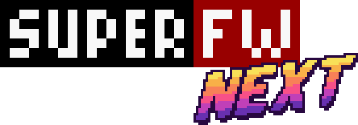
</p>

<p align="center">
  <b>A modern, faster and more reliable menu for Supercard GBA flash carts.</b><br>
  An unofficial fork of <a href="https://github.com/davidgfnet/superfw">SuperFW</a> by davidgf.
</p>

<p align="center">
  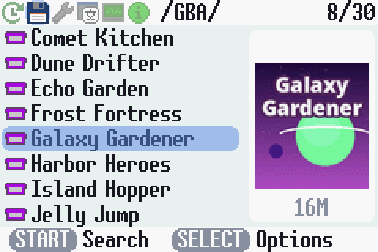
  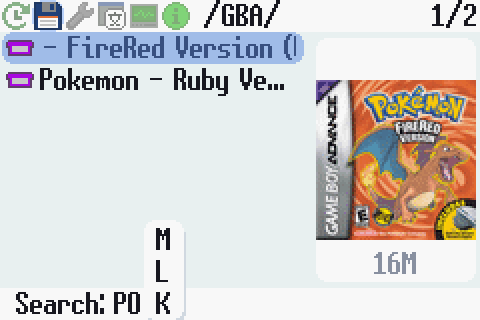
  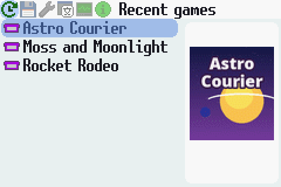
</p>

SuperFW Next (version 0.2) builds on [SuperFW](https://github.com/davidgfnet/superfw),
the open source firmware for Supercard GBA flash carts written by David Guillen
Fandos (davidgf). All the credit for SuperFW goes to him. This fork adds a
redesigned menu, box art, search, responsiveness and reliability fixes, a ROM
manager that prepares the SD card, and debugging tools. It is not endorsed by
the SuperFW author, so please report problems with this fork
[here](https://github.com/vinivius/superfw_next/issues), not upstream. Like
SuperFW, it is free software under the GNU GPL version 3 or later.

## Download

Get the `.fw` file (ie. `superfw-next-v0.2-sd.fw`) from the
[latest release](https://github.com/vinivius/superfw_next/releases/latest),
then follow [Installing or updating](#installing-or-updating). Only the
Supercard SD build is published: it is the one tested on real hardware. The
Lite and CHIS variants build from the same sources (`make BOARD=lite` /
`BOARD=chis`) but have not been tested.

## What's new

The full list is in [docs/superfw-next.md](docs/superfw-next.md). The
screenshots show made-up demo games with original covers.

### A new look

Rounded cards and selection, toggle switches, keycap button hints, and six
color themes (Interface settings): Cloud, Midnight, Grape, Mint, Ember and
Sakura.

<p align="center">
  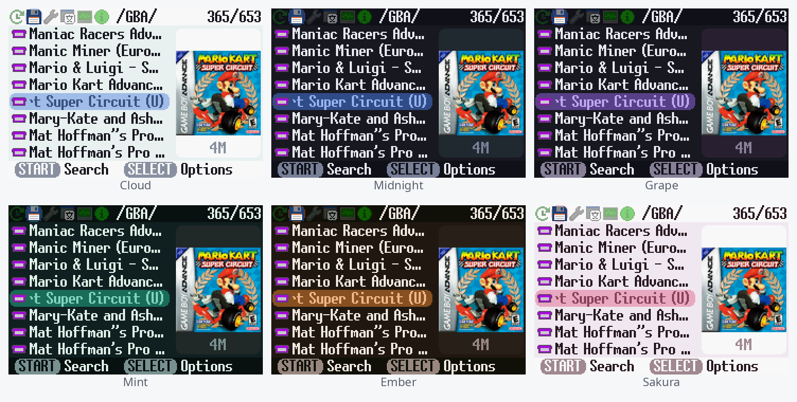
</p>

<p align="center">
  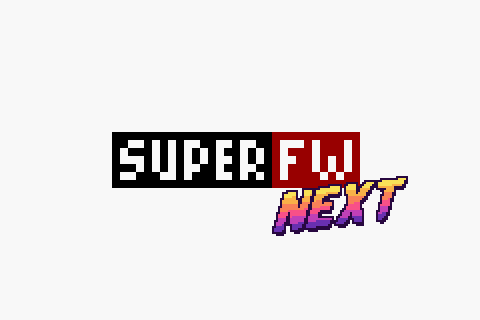
  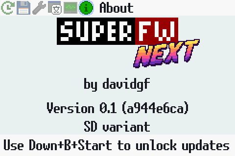
  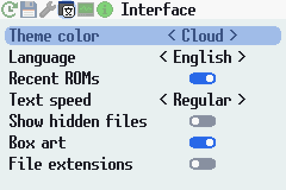
</p>

### Box art

Box art shows next to the ROM browser and the Recent list. It loads once the
cursor rests (never while scrolling), the last 8 images stay in memory and the
games around the cursor are preloaded, so going back and forth is instant.
Art files are spread over 64 folders, so finding one stays fast on cards with
thousands of ROMs. See [ROM manager and box art](#rom-manager-and-box-art) to
create them.

### Search

Press START in the browser. A letter wheel opens at A and the list always
shows what the search bar says: Up/Down pick the letter (L/R jump 5), Right
goes on to the next letter, Left goes back to change the previous one, A or
START close the wheel keeping the results, and B cancels. Space is a letter
too (shown as `_`). The list keeps up even in folders with thousands of
files.

<p align="center">
  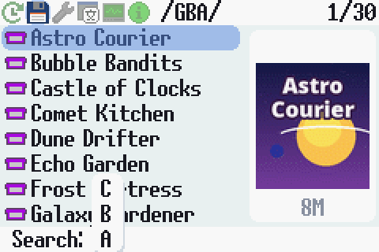
  
</p>

### Responsive

- No lost button presses: buttons are read on every frame and each press is
  counted, however busy the menu is. Only the D-pad repeats (a held A no
  longer launches a game), and holding it speeds up in long lists.
- The menu only redraws what changes and sleeps otherwise. Sitting on a long
  (scrolling) name now costs 10% of a frame instead of 120%.
- Text draws about twice as fast, and big folders show a "Loading folder..."
  counter.

### Easier to use

- The header shows where you are: the tab name, or in the browser the folder
  and your position in it. The bottom bar shows what START and SELECT do.
- The browser reopens where you last launched a game from, and going up a
  folder selects the folder you came from.
- File extensions are hidden (the icon shows the type), settings save
  themselves, and L/R wrap around the tabs.
- Clearer popups with page arrows, and progress bars with a percentage.
- All new text is translated to the 13 languages SuperFW ships.

<p align="center">
  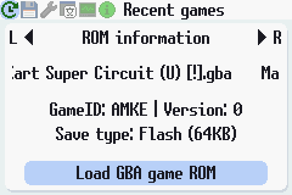
  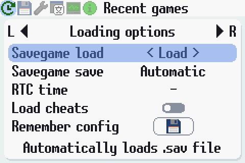
  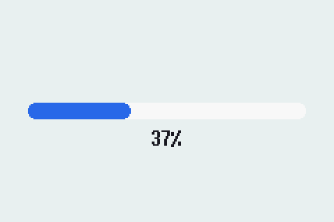
</p>

### More reliable

- Saves are written to a temporary file and checked before they replace the
  current one, so a full card or a failed write can't destroy your save.
  "Save and quit" in the in-game menu only quits once the save worked.
- Firmware updates retry when a step fails, and the screen warns not to turn
  the console off.
- Fixed crashes (more than 200 recent games, damaged settings or recent
  files, long ROM names, oversized patch databases) and sorting (GB before
  GBA).

## ROM manager and box art

`tools/rom-manager-gui.py` (window) and `tools/rom-scraper.py` (command line)
turn a ROM collection into a ready-to-use SD card:

- **Identifies** GBA, GB, GBC and NES ROMs (and more) by CRC32 against the
  No-Intro databases from [libretro-database](https://github.com/libretro/libretro-database),
  and gives them their official names.
- **Organizes** them into one folder per console, copying duplicates only
  once. Saves go to `SAVEGAME/` and cheats come along.
- **Creates box art**: covers are downloaded from
  [libretro-thumbnails](https://github.com/libretro-thumbnails/libretro-thumbnails)
  and converted to the SuperFW art format (80x80, GBA palette,
  [docs/boxart-format.md](docs/boxart-format.md)).
- Never modifies the input collection, and never replaces files already on
  the card unless asked to.

The resulting card:

```
GBA/  GB/  GBC/  NES/          ROMs, with their official names
SAVEGAME/                      save files
.superfw/art/00 ... 3F/        box art (<ROM file name>.img)
.superfw/cheats/  emulators/   cheat database, emulators
```

Usage (Python 3.7+ and Pillow; the window also needs PySide6):

```sh
python3 tools/rom-manager-gui.py                      # pick the input and output folders

python3 tools/rom-scraper.py --input ~/roms --output /media/SDCARD --dry-run   # preview
python3 tools/rom-scraper.py --input ~/roms --output /media/SDCARD             # build the card
python3 tools/rom-scraper.py /media/SDCARD            # rename and add art on an existing card
python3 tools/rom-scraper.py --preview art.img art.png --scale 4               # view an art file
```

Downloads (databases, covers, checksums) are cached in
`~/.cache/superfw-scraper`, so later runs are fast. Run
`python3 tools/rom-scraper.py --help` for all the options (skip saves,
cheats or art, replace files, and more).

## Installing or updating

Use fresh batteries or a power adapter: an update interrupted by a power
loss can leave the cart unbootable (see the NDS flasher in
[Installation](#installation) below to recover it).

1. **Try it first.** Copy the `.fw` file (ie. `superfw-next-v0.2-sd.fw`) to
   the SD card renamed to `superfw-next.gba`, and launch it from the browser
   like a game. It runs
   from memory without touching the cart's flash: turning the console off
   brings back your current firmware.
2. **Flash it.** Copy the `.fw` file to the SD card (keep only one `.fw` file
   there). On the About tab press **Down + B + START** ("Update flashing is
   enabled"), pick the `.fw` file in the browser, press A, then
   **L + R + Up**. Wait for "Flash update complete!" and restart the console.

The firmware header is unchanged, so SuperFW and SuperFW Next can install each
other: to go back, flash an official SuperFW `.fw` the same way. From the
stock Supercard firmware, load the `.fw` renamed to `.gba` like a game, then
flash it from there.

## Building

Needs the Arm GNU toolchain, plus a host `g++` and Python 3 (build tools).

```sh
tools/debug/setup-toolchain.sh                  # Arm GNU toolchain, no root needed
export PATH=~/Work/superfw-dev/toolchain/bin:$PATH
make BOARD=sd                                   # superfw.gba, rename it to .fw to flash
make clean && make BOARD=sd ENABLE_UART_LOGGING=1   # debug build, logs over the link cable
```

Always `make clean` when changing build options.

## Debugging

`tools/debug/` has tools to debug the firmware on a real GBA over a serial
link cable (live logs, button injection, screenshots, SD card file transfer,
trying builds without flashing) and in the gpsp emulator with Supercard
emulation. See [tools/debug/README.md](tools/debug/README.md).

## Credits and license

[SuperFW](https://github.com/davidgfnet/superfw) is written by David Guillen
Fandos (davidgf), see [superfw.davidgf.net](https://superfw.davidgf.net/).
SuperFW Next is based on upstream SuperFW up to commit `bb97fe5`
(2026-10-05) and keeps its license: GNU GPL version 3 or later. Third party
components are listed under [Licenses](#licenses).

## SuperFW documentation

The rest of this README is the upstream SuperFW documentation, which applies
to SuperFW Next too.

An alternative firmware for Supercard GBA flash carts (and derivatives/clones)

This project aims to provide a more modern and better firmware for Supercard
flash carts (which are still widely used and very cheaply available). The goal
is to add many features only present in more expensive or sophisticated flash
carts. Unfortunately we are limited to the actual hardware so certain features
are impossible or very complex to implement.

Find the website and documentation at https://superfw.davidgf.net/


### Installation

Check https://superfw.davidgf.net/docs/install/flash/ for more details.

The firmware can be chain-loaded using another firmware (ie. the default
SuperCard firmware or SCFW) and loaded as a regular game. It can also be
installed on the internal flash device. Installing it enables some nice
features such as SDHC and exFAT compatibility.

To install the firmware you can simply load it first, and then use SuperFW
to flash itself on the flash. You will need to enable flashing in the Info
tab and then pick the .fw file and flash it. It is strongly recommended to
reboot your GBA after flashing.

Flashing is also possible using an NDS. This is particularly useful if you
_brick_ your Supercard (ie. interrupting flashing, low battery conditions
and similar situations could cause a bad flash). You will need an NDS device
and a Slot-1 cart as well. Download the .nds ROM for your Slot-1 cart at
https://github.com/davidgfnet/superfw-nds-flasher-tool/releases/ and launch
it with your Supercard on your Slot-2. You should be able to flash (as well
as backup) your flash.

### GB/GBC Emulation

GameBoy and GameBoy Color ROMs can be played by using the built-in Goombacolor
emulator binary (the Lite build doesn't ship any emulator though). Picking any
.gb/.gbc file will load the emulator and the ROM and start its execution.

Other devices can also be played as long as the right emulator is installed in
the SD card (and supported by SuperFW).

Check https://superfw.davidgf.net/docs/usermanual/emulators/ for details.

### ROM patching

The firmware contains a patch database to patch several features. A custom
database can also be loaded from the SD card and used instead (so more games
and improvements can be added). The patches contain information about:

 - WaitCNT patches: Also called white/black screen patches, prevent games from
   updating the WAITCNT waitstates (the supercard has a slow memory). Without
   a correct patch the game won't even boot.
 - Flash/EEPROM offsets: Indicate where the relevant storage routines are so
   that they can be patched and converted to SRAM storage.
 - IRQ handler patches: Used to patch user IRQ handler routine and install a
   custom one. Used to enable in-game menu.
 - RTC patches: Used for games that contained an RTC IC in theri cart, to keep
   track of time (both time and date). There's only a handful such ROMs.

More information at https://superfw.davidgf.net/docs/usermanual/patches/

These patches are generated mostly automatically, check out the patch repo at:
https://github.com/davidgfnet/gba-patch-gen
It is also possible to use the web-based patch generator for better patches:
https://patchtool.superfw.davidgf.net/

### In-game menu

SuperFW features an in-game menu that allows users to pause the current game
and perform certain actions such as:

  - Resuming and resetting the game
  - Going back to the SuperFW menu (witout having to reboot your GBA)
  - Handling saves (for games that allow saving)
  - Creating and restoring savestates
  - Applying/using cheat codes
  - Changing the RTC time (for games that use an RTC)

This menu is a bit of a hack that requires patching the ROM to work. For this
reason, some games won't work well with it or will suffer from bugs (usually
graphical bugs). In this case it is advised to not use the in-game menu.

Many graphical glitches will result in the screen being "offseted" to the
left/right/up/down. In many cases this is not an issue (besides making it
harder for the user to see and play) and it goes away when entering a new
zone/level/menu. This is due to the GBA featuring some "write-only" registers,
that is, registers that can be written but never read back. For this reason
we cannot properly save and restore said registers.

### Saving games

Save games are stored in the cart's SRAM and preserved by the cart battery
(note that if the battery is dead the game will be lost). On reboot SuperFW
will write the savegame to the SD card to preserve it and allow loading
another save game.

When using the in-game menu, you might enter the menu and select any of the
saving options, which will write the save to the SD card. This is a good
way to save your games if you prefer to manually handle save files (ie.
disabling autosave and manually choosing when to save).

For Flash-based games (around 300 games) and EEPROM-based games (around 1400
games) it is possible to patch games so that they write directly to the SD
save game, this is called Direct-Saving mode. This makes saving more reliable
(no need for a battery!) and simpler to use (no need to reboot to ensure
saving or using the in-game menu). Games that use Flash or EEPROM will display
an option for direct-saving (this is the default choice in Auto mode).

### Files and configuration on the SD card

All SuperFW related files are stored under "/.superfw" at the root of the card.
The following files are usually created:

 - .superfw/settings.txt: User settings, loaded on startup.
 - .superfw/ui-settings.txt: UI settings, loaded on startup.
 - .superfw/recent.txt: Recently played ROMs, in order.
 - .superfw/pending-save.txt: SRAM save information (temp file).
 - .superfw/pending-sram-test.txt: SRAM test flag (temp file).

Other noteworthy paths:

 - .superfw/config/: Per-ROM load configuration.
 - .superfw/patches/: Patch cache (created by PatchEngine).
 - .superfw/cheats/: Cheat database, contains .cht files.
 - .superfw/emulators/: Emulator ROMs, used to play other device's ROMs.

### Limits

The following restrictions apply to the firmware due to memory/storage/cpu
constraints:

 - Maximum ROM size: 32MiB (Supercard's memory size)
 - File path and name limit: 255 utf-8 bytes (not exactly characters!)
 - Maximum number of files+dirs in a directory: 16384

### Licenses

Most of SuperFW was written by davidgf and is published under GPL license.
Some components use third party code, such as: nanoprintf (public domain),
heapsort (3-BSD) and fatfs (1-BSD-like). apultra and upkr (only used at
build-time) were re-implemented in C++ using the original sources as reference
and an LLM (they are under zlib and public domain respecitvely). Some
linkerscript/crt0 code was adapted from AntonioND's work under CC0.


